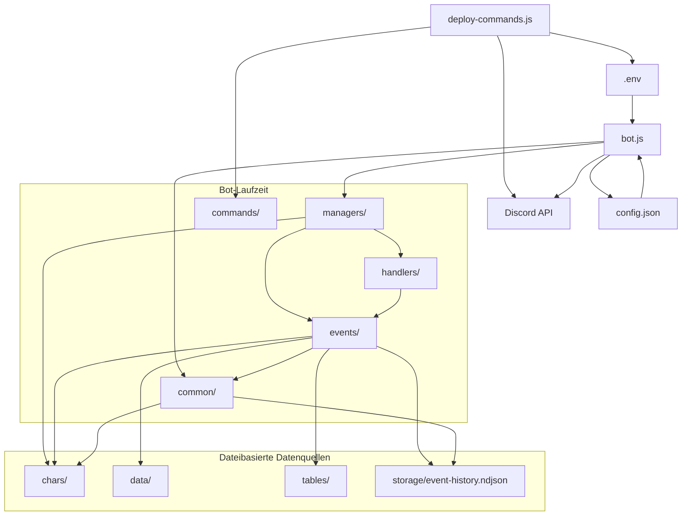
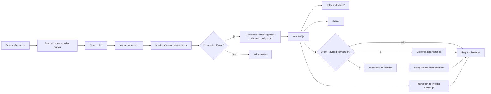

# Architekturüberblick

Diese Datei beschreibt die Laufzeitarchitektur von DSA-Bot v2. Sie erklärt, wie der Bot startet, welche Modulgrenzen es gibt und wie sich technische Discord-Integration und fachliche DSA-Logik im Projekt aufteilen.

## Architektur in einem Satz

DSA-Bot v2 ist ein eventgetriebener Discord-Bot, der technische Discord-Ereignisse über Handler entgegennimmt, an fachliche Event-Module weiterleitet, Character- und Regeldaten aus JSON-Quellen verwendet und fachliche Ergebnisse optional als Event-Historie persistiert.

## Architekturdiagramme

Ja, Mermaid kann hier gut verwendet werden. Für dieses Projekt sind vor allem zwei Sichtweisen sinnvoll:

- eine statische Sicht auf Abhängigkeiten und Modulgrenzen
- eine Ablaufansicht für den typischen Weg einer Discord-Interaction

### Modul- und Abhängigkeitsdiagramm

### Genereller Interaction-Flow

Die Diagramme sind absichtlich generisch gehalten. Sie zeigen den Architekturfluss, ohne sich an ein einzelnes Command wie `probe` oder `angriff` zu binden.

## Kernprinzipien

- `bot.js` ist der produktive Einstiegspunkt und initialisiert die Laufzeit.
- `handlers/` bindet echte Discord-Events an den Client.
- `events/` enthält die fachliche Ausführungslogik für Commands und Komponenten.
- `commands/` definiert nur die Slash-Command-Schemas für Discord.
- `common/` kapselt wiederverwendbare Hilfslogik, Persistenz, Logging und gemeinsam genutzte Domänenfunktionen.
- `chars/`, `data/` und `tables/` liefern fachliche Daten für die Ausführung.
- `storage/` enthält laufzeitgenerierte Persistenzdaten.

## Startphase

Die Startlogik liegt in `bot.js` und läuft in klaren Schritten ab.

### 1. Umgebungsinitialisierung

Zu Beginn wird `.env` geladen. Anschließend werden die benötigten Discord-Credentials aus den Umgebungsvariablen gelesen:

- `DISCORD_TOKEN`
- `CLIENT_ID`
- optional guild-spezifische IDs für Command-Deployment

Wenn Pflichtwerte fehlen, bricht der Prozess früh mit einem Fehlerlog ab. Damit scheitert der Bot bewusst vor dem Discord-Login und nicht erst später während der Laufzeit.

### 2. Aufbau des Discord-Clients

Danach wird ein `discord.js`-Client erstellt. Der Client wird nicht nur als API-Zugang verwendet, sondern zugleich als zentraler Laufzeitcontainer erweitert.

Dem Client werden unter anderem folgende Strukturen angehängt:

- Collections für `events`, `commands`, `slashCommands`, `buttonCommands`, `selectMenus` und weitere Interaktionsarten
- `activeCharactersByUser` für explizit aktivierte Charaktere
- `temporaryMeisters` für temporäre Meisterrechte
- `histories` als In-Memory-Ablage laufender Eventdaten
- `Utils`, `Persistence` und `Common` als gemeinsame Laufzeitmodule
- `characterConfig` aus `config.json`
- `eventHistoryProvider` für persistierte Verlaufsdaten
- `credentials` für späteren Zugriff aus anderen Modulen

### 3. Erweiterung von Discord-Interaktionen

In `bot.js` wird `BaseInteraction.prototype.isMeister` erweitert. Damit steht an nahezu allen Interaktionsstellen eine zentrale Berechtigungsprüfung zur Verfügung.

Architektonisch ist das relevant, weil Rechteprüfung damit nicht lokal in jedem Event neu modelliert wird, sondern als globale Laufzeitfähigkeit existiert.

### 4. Registrierung und Login

Nach dem Aufbau des Clients werden zwei Manager ausgeführt:

- `EventManager(DiscordClient, DirPath)`
- `CharacterManager(DiscordClient, DirPath)`

Erst danach erfolgt `DiscordClient.login(...)`. Die Architektur folgt damit dem Prinzip, dass die komplette Bot-Laufzeit möglichst vorbereitet ist, bevor der Client Ereignisse aus Discord empfängt.

## Modulgrenzen

### `bot.js`

`bot.js` ist Composition Root des Projekts. Dort werden keine fachlichen DSA-Regeln modelliert. Die Datei verbindet Konfiguration, Discord-Client, Manager, Logging und Persistenz zu einer lauffähigen Anwendung.

### `managers/`

Die Dateien unter `managers/` übernehmen Initialisierung und Registrierung.

- `eventHandlerManager.js` lädt rekursiv Dateien aus `handlers/` und `events/`.
- `characterManager.js` lädt Character-Zustand in den Client.

Der architektonische Zweck dieser Ebene ist die Entkopplung von Startlogik und konkreten Modulen. Neue Events oder Handler müssen deshalb nicht manuell in `bot.js` eingetragen werden, solange sie den vorhandenen Dateikonventionen folgen.

### `handlers/`

`handlers/` bildet die technische Adapter-Schicht zur Discord-API. Handler reagieren auf echte Discord-Ereignisse wie `interactionCreate` und delegieren dann in die fachliche Logik.

Der wichtigste Handler ist `handlers/interactionCreate.js`.

Seine Verantwortung ist:

- passende fachliche Event-Module zu finden,
- den aktuellen Character aufzulösen,
- die Event-Ausführung anzustoßen,
- Fehler konsistent zu loggen und an den Benutzer zurückzumelden,
- sowie Event-Payloads in Historie und Persistenz zu schreiben.

### `events/`

`events/` bildet die fachliche Anwendungsschicht. Hier liegt die eigentliche Bot-Logik für Probe, Angriff, Parade, Ressourcenverwaltung, Hilfe, GM-Funktionen und andere Interaktionen.

Ein Event-Modul beschreibt typischerweise:

- für welche Interaction-Art es zuständig ist,
- wie ein Request validiert wird,
- wie fachliche Daten gelesen und verändert werden,
- welche Discord-Antwort erzeugt wird,
- und ob ein persistierbares Event zurückgegeben wird.

### `commands/`

`commands/` enthält ausschließlich die Slash-Command-Definitionen. Diese Dateien sind für Discord-Registrierung notwendig, enthalten aber nicht die eigentliche Geschäftslogik.

Das bedeutet architektonisch:

- `commands/` beschreibt die öffentliche Schnittstelle gegenüber Discord.
- `events/` beschreibt die interne Verarbeitung.

Diese Trennung reduziert Kopplung zwischen API-Definition und Ausführung, verlangt aber Disziplin: Änderungen an Optionen oder Namen müssen konsistent in beiden Bereichen nachgezogen werden.

### `common/`

`common/` enthält gemeinsam genutzte Bausteine mit Querschnittscharakter.

Wichtige Rollen in diesem Verzeichnis:

- `logger.js`: strukturierte Laufzeitlogs mit `traceId`
- `persistence.js`: dateibasierte Character- und Konfigurationspersistenz
- `eventHistoryProvider.js`: persistierte fachliche Verlaufsdaten
- `utils.js`: Character-Auflösung, Embed-Helfer und wiederverwendete Ausführungslogik
- `character.js`: Character-Modell zur Laufzeit

## Laufzeitfluss

Der wichtigste Laufzeitfluss ist die Verarbeitung einer Discord-Interaction.

### 1. Discord erzeugt ein Event

Nach erfolgreichem Login liefert Discord Ereignisse an den Client. Ein technischer Handler aus `handlers/` nimmt das Ereignis entgegen.

### 2. Technischer Handler delegiert in fachliche Events

Bei `interactionCreate` iteriert `handlers/interactionCreate.js` über alle registrierten Event-Module aus `DiscordClient.events`.

Ein Modul gilt als passend, wenn mindestens eine der folgenden Bedingungen zutrifft:

- der Eventname entspricht dem Slash-Command-Namen,
- oder die Custom-ID einer Komponente beginnt mit einem der registrierten Prefixe.

### 3. Character-Auflösung

Vor der fachlichen Ausführung wird über `DiscordClient.Utils.getChar(...)` der aktive Character bestimmt. Diese Auflösung nutzt entweder einen explizit gesetzten aktiven Character oder die Alias-Konfiguration in `config.json`.

### 4. Fachliche Ausführung

Das passende Event-Modul unter `events/` verarbeitet die Interaction. Dort werden typischerweise:

- Eingaben ausgelesen,
- Regeldaten aus `data/` oder `tables/` gesucht,
- Character-Daten gelesen oder verändert,
- Antwort-Embeds erzeugt,
- und optional persistierbare Event-Payloads gebaut.

### 5. Rückgabe und Persistenz

Wenn ein Event-Modul ein Event oder ein Event-Array zurückgibt, wird dieses vom Handler weiterverarbeitet:

- In-Memory-Ablage unter `DiscordClient.histories`
- Persistenz über `DiscordClient.eventHistoryProvider`

Damit trennt die Architektur sauber zwischen unmittelbarer Benutzerantwort und späterer Auswertung des fachlichen Verlaufs.

## Datenbereiche in der Architektur

### `chars/`

Hier liegen Character-Dateien. Diese Dateien enthalten den anwendungsrelevanten Zustand einzelner Figuren und werden bei Änderungen direkt auf Dateiebene persistiert.

### `data/`

Hier liegen statische Regeldaten wie Fertigkeiten, Zauber, Liturgien, Waffen und weitere DSA-Quellen. Diese Daten sind Input für Event-Logik, werden aber nicht als laufende Session-Daten behandelt.

### `tables/`

Hier liegen Regeltabellen für bestimmte Effekte oder Klassifikationen. Tabellen sind ebenfalls statische Datenquellen, aber konzeptionell stärker auf Ableitungen und Auswertung ausgerichtet als die breiteren Stammdaten unter `data/`.

### `storage/`

Hier liegen laufzeitgenerierte Dateien. Aktuell ist besonders `storage/event-history.ndjson` relevant. Diese Datei ist Teil der Beobachtbarkeit und bildet zugleich eine Grundlage für Features wie Historie, letzte Proben oder statistische Auswertungen.

## Laufzeitzustand

Der Bot hat zwei Arten von Zustand.

### Persistierter Zustand

- Character-Dateien in `chars/`
- Event-History in `storage/event-history.ndjson`
- Laufzeitkonfiguration in `config.json`

### Flüchtiger Zustand

- Collections auf dem Discord-Client
- `activeCharactersByUser`
- `temporaryMeisters`
- In-Memory-Historie während der laufenden Session

Diese Trennung ist wichtig, weil nicht jede Laufzeitinformation einen Neustart überlebt. Neue Features sollten deshalb bewusst entscheiden, ob ein Zustand nur während der Session oder dauerhaft benötigt wird.

## Architekturentscheidungen und Konsequenzen

### Dateisystem statt externer Datenbank

Character-Zustand und Event-Historie werden lokal in Dateien gespeichert. Das vereinfacht Betrieb und Entwicklung, bedeutet aber auch:

- keine Transaktionen,
- keine konkurrierende Mehrinstanz-Architektur,
- begrenzte Robustheit bei gleichzeitigen Schreibvorgängen,
- einfache manuelle Inspektion der Daten.

### Dynamisches Dateiladen

Events und Handler werden rekursiv über Dateiscan geladen. Das macht Erweiterungen einfach, verschiebt aber Fehler in Dateinamen, Modulformat oder Exporte in die Startphase statt in statische Registrierung.

### Erweiterter Client als Service-Container

Der Discord-Client dient zugleich als zentraler Service-Container. Das ist pragmatisch und im Projekt konsistent, erzeugt aber eine relativ breite Verantwortung des Client-Objekts. Neue Fähigkeiten sollten deshalb möglichst klar benannt und nicht redundant an mehreren Stellen abgelegt werden.

## Bekannte Strukturspur aus älterem Code

Neben `bot.js` existiert mit `index.js` ein älterer alternativer Einstiegspunkt. Die aktuelle Architekturreferenz für neue Arbeit ist `bot.js`.

Wenn die Laufzeitstruktur weiter vereinheitlicht wird, sollte diese Datei später noch um eine klare Migrationsnotiz für alte und neue Initialisierungsmuster ergänzt werden.

## Orientierung für Folgekapitel

- Für den konkreten Request-Fluss zwischen Slash-Command, Button und Event-Modul siehe `command-lifecycle.md`.
- Für Character-Strukturen, Regeldaten und Event-Payloads siehe `domain-model.md`.
- Für Persistenzdetails und Historienauswertung siehe `persistence-and-history.md`.
- Für Betriebsparameter und Beobachtbarkeit siehe `configuration.md`.