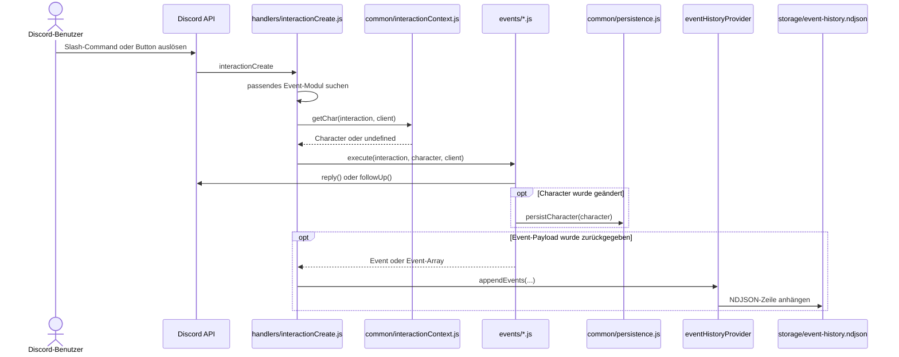

# Interaktions- und Command-Flow

Diese Datei beschreibt den Weg eines Commands oder einer Komponenten-Interaktion durch das System. Im Mittelpunkt stehen Registrierung, Routing, Character-Auflösung, fachliche Ausführung sowie die Rückgabe und Persistenz von Event-Payloads.

## Überblick

Der Ablauf besteht aus zwei getrennten Phasen:

1. Registrierung der Slash-Command-Schemas bei Discord
2. Laufzeitverarbeitung einer eingehenden Interaction

Architektonisch wichtig ist die Trennung zwischen `commands/` und `events/`:

- `commands/` beschreibt, welche Slash-Commands Discord kennt.
- `events/` beschreibt, wie der Bot fachlich auf diese Interaktionen reagiert.

## Ablaufdiagramm

## Phase 1: Registrierung der Slash-Commands

Slash-Commands werden nicht automatisch aus `events/` abgeleitet. Stattdessen definiert jede Datei unter `commands/` ein Slash-Command-Schema mit `SlashCommandBuilder`.

Beispiel:

- `commands/probe.js` definiert den Command-Namen `probe`
- dort werden Beschreibung und Optionen wie `fertigkeitsname` und `bonus-malus` festgelegt

Die Registrierung bei Discord erfolgt über `deploy-commands.js`:

1. das Skript lädt alle Dateien unter `commands/`
2. es wandelt `command.data` per `toJSON()` in Discord-kompatible Nutzdaten um
3. es sendet diese Daten über die Discord-REST-API an die konfigurierten Guilds

Wichtig:

- Änderungen an `commands/*.js` werden erst nach erneutem Ausführen von `deploy-commands.js` in Discord sichtbar.
- Änderungen nur in `events/*.js` brauchen kein erneutes Deployment, solange Name und Struktur des Slash-Commands gleich bleiben.

## Phase 2: Laufzeitverarbeitung einer Interaction

Sobald der Bot läuft und Discord ein `interactionCreate` auslöst, übernimmt `handlers/interactionCreate.js` die zentrale Routing-Funktion.

### 1. Eingang im technischen Handler

Der Handler bekommt eine Discord-Interaction und erzeugt zunächst eine `traceId` für Logging und Nachverfolgbarkeit. Danach iteriert er über alle registrierten fachlichen Event-Module in `DiscordClient.events`.

### 2. Matching des passenden Event-Moduls

Ein Event-Modul gilt als passend, wenn mindestens eine der folgenden Bedingungen erfüllt ist:

- `event.type === 'interactionCreate'` und `event.name === interaction.commandName`
- `event.type === 'interactionCreate'` und `event.name === '*'`
- `interaction.customId` beginnt mit einem Eintrag aus `event.customIds`

Damit unterstützt das Projekt zwei zentrale Interaktionsarten mit derselben Event-Sammlung:

- Slash-Commands
- Komponenten wie Buttons mit Custom-ID-Präfixen

## Character-Auflösung

Vor der fachlichen Ausführung löst der Handler den aktuellen Character über `common/interactionContext.js` (`getChar`) auf.

Die Reihenfolge ist:

1. Wenn ein Benutzer in `activeCharactersByUser` einen aktiven Character gesetzt hat, wird dieser bevorzugt.
2. Andernfalls wird die Alias-Zuordnung aus `client.characterConfig.alias` verwendet.
3. Anschließend wird der passende Character in `client.characters` gesucht.

Wichtig für Event-Module:

- `character` kann `undefined` sein, wenn kein Alias existiert oder kein Character geladen wurde.
- Fachliche Logik sollte deshalb fehlende Characters entweder explizit behandeln oder nur an Stellen voraussetzen, an denen die Existenz abgesichert ist.

## Fachliche Ausführung im Event-Modul

Nach dem Matching ruft der Handler `event.execute(interaction, character, client)` auf. Dort findet die eigentliche Geschäftslogik statt.

Typischerweise macht ein Event-Modul Folgendes:

1. Guard-Klauseln für den konkreten Interaction-Typ prüfen
2. Optionen oder Custom-ID-Payload auslesen
3. Regeldaten aus `data/` oder `tables/` auflösen
4. Character-Daten lesen oder verändern
5. eine Discord-Antwort erzeugen
6. optional eine persistierbare Event-Payload zurückgeben

Das Modul `events/probe.js` zeigt beide Hauptpfade:

- Slash-Command-Pfad über `interaction.isChatInputCommand()` und `interaction.commandName === 'probe'`
- Button-Pfad über `interaction.isButton()` und das Präfix `probe:quick:`

## Unterschiede zwischen Slash-Commands und Button-Interaktionen

### Slash-Commands

Bei Slash-Commands stammt die Eingabe aus `interaction.options`. Beispiel `probe`:

- `fertigkeitsname`
- `bonus-malus`

Die fachliche Logik prüft die Eingabe, sucht die passende Fertigkeit, berechnet das Ergebnis und sendet dann ein Embed als Antwort.

### Buttons

Bei Buttons stammt die Eingabe aus der `customId`. Das Projekt verwendet dafür Präfixe und kodierte Payloads.

Beispiel `probe:quick:`:

- der Präfix identifiziert das zuständige Event-Modul
- der Rest der Custom-ID kodiert Kategorie, Namen und optional Bonus/Malus

Damit können Buttons denselben fachlichen Kern nutzen wie Slash-Commands, ohne ein eigenes Routing-System zu brauchen.

## Rückgabewerte von Event-Modulen

Event-Module können mehr tun als nur auf Discord antworten. Sie können zusätzlich ein Event oder ein Array von Events zurückgeben.

Im aktuellen Projekt hat das zwei Folgen:

1. Die Daten werden in `DiscordClient.histories` abgelegt.
2. Die Daten werden über `DiscordClient.eventHistoryProvider.appendEvents(...)` persistiert.

Das ist der eigentliche Vertrag zwischen fachlicher Ausführung und Verlaufssystem.

Praktische Konsequenzen:

- Wenn ein Event-Modul `null` oder `undefined` zurückgibt, erfolgt keine Event-History-Persistenz.
- Wenn ein Event-Modul ein serialisierbares Event zurückgibt, wird dieses für spätere Auswertung verfügbar.
- Wenn ein Event-Modul Character-Daten verändert, muss es die Character-Persistenz selbst anstoßen; die History-Persistenz ersetzt das nicht.

## Fehlerbehandlung im Ablauf

Fehler im Event-Modul werden im `try/catch` von `handlers/interactionCreate.js` abgefangen.

Das Verhalten ist:

1. Fehler wird mit `traceId` geloggt.
2. Falls die Interaction schon beantwortet oder deferred wurde, folgt ein `followUp(...)`.
3. Andernfalls erfolgt ein `reply(...)` mit einer ephemeren Fehlermeldung.

Dadurch bleibt die Fehlerbehandlung zentralisiert, auch wenn die Fachlogik auf viele Event-Dateien verteilt ist.

## Beispiel: Ablauf von `/probe`

Der konkrete Ablauf eines Probe-Commands ist typischerweise:

1. `commands/probe.js` definiert Name und Optionen.
2. `deploy-commands.js` registriert den Slash-Command bei Discord.
3. Ein Benutzer ruft `/probe` auf.
4. Discord löst `interactionCreate` aus.
5. `handlers/interactionCreate.js` findet `events/probe.js`.
6. `common/interactionContext.js` löst den Character des Benutzers auf.
7. `events/probe.js` liest Optionen und sucht die Fertigkeit in den Regeldaten.
8. Das Event-Modul erzeugt Embed und Event-Payload.
9. Die Antwort wird an Discord gesendet.
10. Der Character wird bei Bedarf persistiert.
11. Die Event-Payload wird in die Historie übernommen und als NDJSON gespeichert.

## Typische Änderungsfälle

### Nur Text oder Berechnung ändern

Wenn sich nur die fachliche Logik, Texte oder Embeds ändern, reicht meist eine Änderung unter `events/` oder `common/`. Ein neues Command-Deployment ist dann normalerweise nicht nötig.

### Neue Slash-Option hinzufügen

Wenn ein neuer Parameter in Discord sichtbar sein soll, müssen mindestens zwei Stellen angepasst werden:

- das Schema unter `commands/`
- die Verarbeitung unter `events/`

Danach muss `deploy-commands.js` erneut ausgeführt werden.

### Neuen Button hinzufügen

Ein neuer Button braucht typischerweise:

- eine `customId` oder ein Präfixschema
- Matching über `customIds` im zuständigen Event-Modul
- Parsing und Validierung im Event-Modul selbst

Ein erneutes Slash-Command-Deployment ist dafür nur nötig, wenn sich zugleich das registrierte Command-Schema ändert.

## Prüffragen für neue Event-Module

Vor dem Einbau eines neuen Commands oder einer neuen Komponenten-Interaktion sollten diese Fragen beantwortet sein:

- Wo wird das Discord-Schema definiert: in `commands/` oder nur als Komponentenlogik?
- Woran erkennt `handlers/interactionCreate.js` das zuständige Event?
- Braucht die Fachlogik zwingend einen Character?
- Wird nur geantwortet oder auch eine Event-Payload zurückgegeben?
- Muss zusätzlich Character-Zustand persistent gespeichert werden?
- Welche Fehlerfälle sollen dem Benutzer ephemer angezeigt werden?

## Orientierung für Folgekapitel

- Für die statische Einordnung der beteiligten Schichten siehe `architecture.md`.
- Für Character-Daten, Regeldaten und Event-Strukturen siehe `domain-model.md`.
- Für Historie und Persistenzdetails siehe `persistence-and-history.md`.